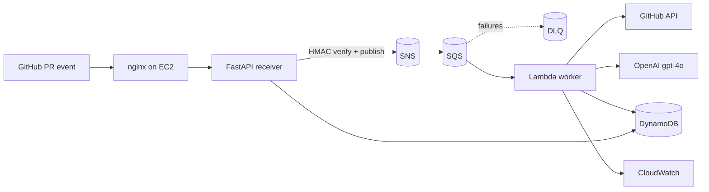

# GitHub PR Automated Code Reviewer

An event-driven service that automatically reviews GitHub pull requests with an
LLM and posts inline comments back to the PR. Built on AWS (EC2 + SNS + SQS +
Lambda + DynamoDB + CloudWatch), GitHub Apps, and OpenAI `gpt-4o`.

When a PR is opened, a webhook hits a FastAPI receiver on EC2, which validates
the signature and publishes to SNS. SNS fans out to SQS; a Lambda worker pulls
the job, fetches the diff, asks `gpt-4o` for a structured review constrained to
the diff's commentable lines, posts the review, and records everything in
DynamoDB. CloudWatch logs every step and alarms on queue backlog, Lambda error
rate, and slow processing.

---

## Architecture



Full diagram and design rationale: [`docs/architecture.md`](docs/architecture.md).

---

## Folder structure

```
github-pr-reviewer/
├── README.md                     # this file
├── .env.example                  # every env var, documented
├── .gitignore
├── docs/
│   └── architecture.md           # mermaid diagram + design notes
├── fastapi-app/                  # webhook receiver + REST API (runs on EC2)
│   ├── requirements.txt
│   ├── app/
│   │   ├── main.py               # FastAPI entrypoint, wires routers
│   │   ├── config.py             # pydantic-settings config
│   │   ├── github_verify.py      # HMAC SHA-256 signature verification
│   │   ├── aws_clients.py        # boto3 SNS + DynamoDB singletons
│   │   ├── models.py             # pydantic response models
│   │   └── routers/
│   │       ├── webhook.py        # POST /webhook/github
│   │       ├── reviews.py        # GET /reviews, GET /reviews/{id}
│   │       ├── repos.py          # GET /repos/{repo}/reviews
│   │       ├── stats.py          # GET /stats
│   │       └── health.py         # GET /health
│   └── tests/
│       └── test_webhook.py       # signature + routing tests (pytest)
├── lambda/                       # PR processing worker
│   ├── handler.py                # SQS entrypoint + orchestration
│   ├── github_client.py          # App auth, diff fetch/parse, post review
│   ├── openai_reviewer.py        # gpt-4o review + output validation
│   ├── dynamo.py                 # idempotent claim + status writes
│   ├── config.py                 # env config
│   └── requirements.txt
├── analytics/                    # data layer: DynamoDB -> S3 -> Athena
│   ├── export_to_s3.py           # daily export Lambda
│   └── athena_queries.sql        # table DDL + example analytical queries
├── infra/                        # AWS provisioning (CLI scripts)
│   ├── 01_create_dynamodb.sh
│   ├── 02_create_sns_sqs.sh      # SNS + SQS + DLQ + subscription
│   ├── 03_create_cloudwatch_alarms.sh
│   ├── 04_lambda_deploy.sh       # package + deploy + event source mapping
│   ├── 05_create_analytics.sh    # S3 + export Lambda + EventBridge + Athena
│   └── iam_policies/
│       ├── lambda_policy.json
│       └── ec2_policy.json
├── deploy/                       # EC2 deployment
│   ├── ec2_setup.sh              # one-shot bootstrap
│   ├── pr-reviewer.service       # systemd unit
│   └── nginx.conf                # reverse proxy
└── scripts/
    └── simulate_webhook.py       # send a signed test webhook
```

---

## Prerequisites

- An AWS account, `aws` CLI v2 configured with admin-ish credentials.
- A domain name (recommended) so you can serve the webhook over HTTPS.
- An OpenAI API key with access to `gpt-4o`.
- Python 3.11+ locally for packaging the Lambda.

> **Cost reality check:** `gpt-4o` is billed per token, and every PR (and every
> new commit on a PR, if you keep `synchronize`) triggers a paid call. EC2
> `t2.micro` is free-tier eligible for 12 months, then ~\$8.50/mo. SNS/SQS/Lambda/
> DynamoDB on-demand are effectively free at portfolio volume. Set an OpenAI
> spend limit before pointing this at a busy repo.

---

## Deployment order (do these in sequence)

The pieces depend on each other, so order matters.

### 1. Create AWS data + messaging layer

```bash
export AWS_REGION=us-east-1
bash infra/01_create_dynamodb.sh
bash infra/02_create_sns_sqs.sh        # PRINTS the ARNs you need next — save them
```

Record `SNS_TOPIC_ARN` and `SQS_QUEUE_ARN` from the script output.

### 2. Create IAM roles

Lambda execution role (trusts `lambda.amazonaws.com`) with
`infra/iam_policies/lambda_policy.json`:

```bash
cat > /tmp/lambda-trust.json <<'JSON'
{"Version":"2012-10-17","Statement":[{"Effect":"Allow",
"Principal":{"Service":"lambda.amazonaws.com"},"Action":"sts:AssumeRole"}]}
JSON

aws iam create-role --role-name pr-review-lambda-role \
  --assume-role-policy-document file:///tmp/lambda-trust.json
aws iam put-role-policy --role-name pr-review-lambda-role \
  --policy-name pr-review-lambda-policy \
  --policy-document file://infra/iam_policies/lambda_policy.json
# Note the role ARN it returns -> LAMBDA_ROLE_ARN
```

EC2 instance role (trusts `ec2.amazonaws.com`) with
`infra/iam_policies/ec2_policy.json`, then create an instance profile and attach
it to the EC2 instance you launch in step 5.

```bash
cat > /tmp/ec2-trust.json <<'JSON'
{"Version":"2012-10-17","Statement":[{"Effect":"Allow",
"Principal":{"Service":"ec2.amazonaws.com"},"Action":"sts:AssumeRole"}]}
JSON

aws iam create-role --role-name pr-review-ec2-role \
  --assume-role-policy-document file:///tmp/ec2-trust.json
aws iam put-role-policy --role-name pr-review-ec2-role \
  --policy-name pr-review-ec2-policy \
  --policy-document file://infra/iam_policies/ec2_policy.json
aws iam create-instance-profile --instance-profile-name pr-review-ec2-profile
aws iam add-role-to-instance-profile \
  --instance-profile-name pr-review-ec2-profile --role-name pr-review-ec2-role
```

### 3. Create the GitHub App (see detailed steps below)

You need the **App ID**, a **private key (.pem)**, and a **webhook secret**.
Leave the webhook URL pointing at a placeholder for now; you'll set it once EC2
has a public address (step 6).

### 4. Deploy the Lambda worker

```bash
export LAMBDA_ROLE_ARN=arn:aws:iam::<acct>:role/pr-review-lambda-role
export SQS_QUEUE_ARN=arn:aws:sqs:us-east-1:<acct>:pr-review-queue
export GITHUB_APP_ID=123456
export GITHUB_APP_PRIVATE_KEY="$(awk '{printf "%s\\n", $0}' your-app.private-key.pem)"
export OPENAI_API_KEY=sk-...
bash infra/04_lambda_deploy.sh
```

### 5. Create CloudWatch alarms

```bash
# optional: an SNS topic (email-subscribed) to receive alarm notifications
export ALARM_SNS_ARN=arn:aws:sns:us-east-1:<acct>:pr-ops-alerts   # optional
bash infra/03_create_cloudwatch_alarms.sh
```

### 6. Launch + configure EC2

1. Launch an Ubuntu 22.04/24.04 `t2.micro`. Attach the `pr-review-ec2-profile`
   instance profile. Security group: inbound 22 (your IP), 80, 443.
2. SSH in, install git, clone this repo (or `scp` it up).
3. Run the bootstrap:

   ```bash
   sudo bash deploy/ec2_setup.sh
   ```

4. Create the env file and start the service:

   ```bash
   sudo cp .env.example /opt/pr-reviewer/fastapi-app/.env
   sudo nano /opt/pr-reviewer/fastapi-app/.env     # set GITHUB_WEBHOOK_SECRET + SNS_TOPIC_ARN
   sudo chown prreviewer:prreviewer /opt/pr-reviewer/fastapi-app/.env
   sudo chmod 600 /opt/pr-reviewer/fastapi-app/.env
   sudo systemctl start pr-reviewer
   curl http://127.0.0.1:8000/health      # -> {"status":"ok",...}
   ```

5. (Recommended) Add TLS: point a DNS A record at the instance, set
   `server_name` in `/etc/nginx/sites-available/pr-reviewer`, then
   `sudo certbot --nginx -d your.domain.com`.

### 7. Point the GitHub App webhook at EC2

In the App settings, set **Webhook URL** to
`https://your.domain.com/webhook/github` (or `http://<EC2_PUBLIC_IP>/webhook/github`
if you skipped TLS — not recommended). Save. GitHub sends a `ping`; you should
see `pong` and a 200 in `journalctl -u pr-reviewer -f`.

### 8. Install the App on a repo and open a PR

Install the App on a test repo, open a PR, and watch:
`journalctl -u pr-reviewer -f` on EC2, the Lambda logs in CloudWatch, and the
PR for posted comments.

### 9. (Optional) Set up the analytics layer

After a few reviews have completed, export them to S3 and stand up Athena:

```bash
export AWS_REGION=us-east-1
bash infra/05_create_analytics.sh
```

This creates an S3 bucket, an export Lambda (DynamoDB -> S3 JSONL, runs daily
via EventBridge), and an Athena database/table with partition projection. The
script runs the export once immediately and creates the table, so you can run
the queries in `analytics/athena_queries.sql` right away from the Athena
console (set the query result location to the bucket's `athena-results/`
prefix if prompted).

---

## Creating the GitHub App (step by step)

1. Go to **GitHub → Settings → Developer settings → GitHub Apps → New GitHub App**
   (org-level: `https://github.com/organizations/<org>/settings/apps/new`).
2. **GitHub App name:** anything unique, e.g. `my-pr-reviewer`.
3. **Homepage URL:** your repo or site (any valid URL).
4. **Webhook → Active:** checked.
   - **Webhook URL:** `https://your.domain.com/webhook/github` (placeholder ok for now).
   - **Webhook secret:** generate a strong value and save it — this is
     `GITHUB_WEBHOOK_SECRET`. (`python -c "import secrets;print(secrets.token_hex(32))"`)
5. **Repository permissions:**
   - **Pull requests:** Read and write  (needed to read the PR and post reviews)
   - **Contents:** Read-only             (needed to read the diff)
   - **Metadata:** Read-only             (mandatory, auto-selected)
6. **Subscribe to events:** check **Pull request**.
7. **Where can this app be installed:** "Only on this account" is fine for a portfolio.
8. **Create GitHub App.**
9. On the App page, note the **App ID** (`GITHUB_APP_ID`).
10. Scroll to **Private keys → Generate a private key.** A `.pem` downloads —
    this is `GITHUB_APP_PRIVATE_KEY`. Keep it secret; never commit it.
11. **Install App** (left sidebar) → install on the account → choose the repo(s).
    The webhook payload will then include `installation.id`, which the worker
    uses to mint installation tokens.

---

## API endpoints

| Method | Path | Description |
|--------|------|-------------|
| POST | `/webhook/github` | Receive GitHub events (signature-verified) |
| GET | `/reviews` | List all reviews (newest first) |
| GET | `/reviews/{id}` | Get one review |
| GET | `/repos/{owner}/{repo}/reviews` | Reviews for a repo (also accepts `owner__repo`) |
| GET | `/stats` | Totals + average processing time |
| GET | `/health` | Liveness |
| GET | `/docs` | Swagger UI (FastAPI auto-docs) |

---

## DynamoDB schema

**`reviews`** (PK `reviewId`): `repoName`, `prNumber`, `prTitle`, `author`,
`status` (`PENDING|PROCESSING|COMPLETED|FAILED`), `diffSize`, `commentsPosted`,
`reviewSummary`, `processingTimeMs`, `createdAt`, `completedAt`, `headSha`.

**`repositories`** (PK `repoId`): `repoName`, `installationId`, `totalReviews`
(atomic counter), `registeredAt`.

---

## Analytics layer (DynamoDB -> S3 -> Athena)

On top of the operational pipeline above, a small batch layer turns review
history into a queryable dataset:

```
DynamoDB (reviews) --[daily Lambda export]--> S3 (JSONL, partitioned by date)
                                                     |
                                                     v
                                          Athena (SQL queries)
```

* **`analytics/export_to_s3.py`** — scans the `reviews` table and writes one
  JSON object per line to `s3://<bucket>/reviews/dt=YYYY-MM-DD/reviews.jsonl`.
  Runs daily via an EventBridge schedule (see `infra/05_create_analytics.sh`).
* **`analytics/athena_queries.sql`** — the Athena table DDL (using **partition
  projection**, so new daily partitions are queryable with zero maintenance —
  no `MSCK REPAIR TABLE`), plus five example queries:
  - reviews and completion rate per repo
  - processing-time percentiles (p50/p95) per repo — directly checks the 45s SLA
  - diff size vs. processing time / comment volume
  - daily review volume and failure trend
  - most-reviewed authors and average comments received

This is a deliberately simple **batch ETL** pattern (full re-scan, daily). At
larger scale you'd replace the scan with **DynamoDB Streams -> Kinesis Firehose**
for continuous incremental export — worth mentioning as the next step if asked.

---

## CloudWatch alarms

| Alarm | Metric | Condition |
|-------|--------|-----------|
| `pr-review-queue-depth-high` | `AWS/SQS ApproximateNumberOfMessagesVisible` | > 10 |
| `pr-review-lambda-error-rate-high` | metric math `100*Errors/Invocations` | > 5% |
| `pr-review-processing-time-high` | custom `PRReviewer/ReviewProcessingTimeMs` | > 45000 ms |

---

## Testing

Receiver unit tests:

```bash
cd fastapi-app
pip install -r requirements.txt pytest
GITHUB_WEBHOOK_SECRET=testsecret SNS_TOPIC_ARN=arn:aws:sns:us-east-1:000:test pytest -q
```

Simulate a full webhook against a running server:

```bash
GITHUB_WEBHOOK_SECRET=<yoursecret> python scripts/simulate_webhook.py \
  --url https://your.domain.com/webhook/github \
  --repo <owner/repo> --pr <n> --installation <id> --sha <head_commit_sha>
```

Use real `--repo/--installation/--sha` to exercise the Lambda half; defaults are
enough to verify the receiver, signature check, and SNS publish.

---

## Security notes

- Webhook signature validation (HMAC SHA-256) is mandatory and enforced before
  any processing; bad signatures get a 401 and are never published.
- Secrets (webhook secret, App private key, OpenAI key) live in the EC2 `.env`
  (chmod 600) and Lambda environment variables — never in the repo.
- IAM policies are least-privilege per role (see `infra/iam_policies/`).
- The webhook endpoint should be HTTPS in production.

---

## Possible improvements

A few things I'd do differently for a real production deployment:

- Add a GSI on the reviews table so listing/filtering doesn't rely on full
  table scans.
- Move secrets (API keys, webhook secret) into Secrets Manager instead of
  plain env vars.
- Add auth on the read API before exposing it publicly.
```
