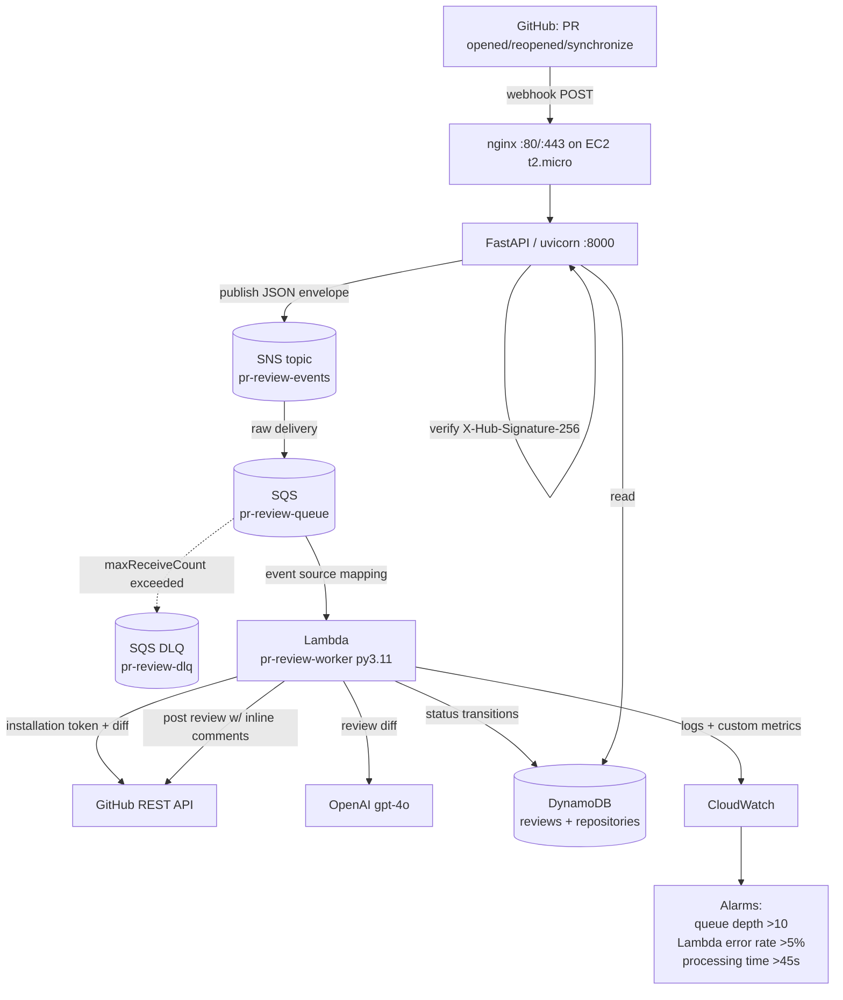

# Architecture

## End-to-end flow



## Why each component

| Component | Role | Notes |
|-----------|------|-------|
| **nginx** | TLS termination + reverse proxy | keeps uvicorn on localhost; handles large payloads |
| **FastAPI (EC2)** | Webhook receiver + read API | validates HMAC, publishes to SNS, serves history |
| **SNS** | Fan-out | one consumer today; lets you add more subscribers (Slack notifier, audit sink) with zero receiver changes |
| **SQS + DLQ** | Durable buffer + retry | decouples spiky webhook traffic from slow AI calls; DLQ isolates poison messages |
| **Lambda** | Review worker | scales to concurrent PRs; idempotent; emits metrics |
| **OpenAI gpt-4o** | The actual review | constrained to commentable diff lines |
| **DynamoDB** | Job tracking + history | status at every transition; atomic repo counters |
| **CloudWatch** | Observability | logs + 3 alarms |

## The hard part: diff-line mapping

GitHub's "create review" API rejects (HTTP 422) any inline comment whose
`line`/`side` is not part of the diff. The worker therefore:

1. Fetches the unified diff (`Accept: application/vnd.github.v3.diff`).
2. Parses it into `{path: {valid new-file line numbers}}` (added lines only).
3. Passes that allow-list to the model and **re-validates** every returned
   comment against it, dropping invalid ones.
4. Falls back to a summary-only review if the inline batch is still rejected,
   so feedback is never lost.

## Idempotency contract

`reviewId = uuid5("<repo>#<pr_number>#<head_sha>")`.

- First delivery → conditional `PutItem (attribute_not_exists)` succeeds → process.
- Duplicate SQS delivery for an already-`COMPLETED` head SHA → no-op, no double comment.
- New commit → new `head_sha` → new `reviewId` → fresh review.

## Status lifecycle

```
PENDING  ->  PROCESSING  ->  COMPLETED
                         \->  FAILED  (re-raised so SQS retries, then DLQ)
```
